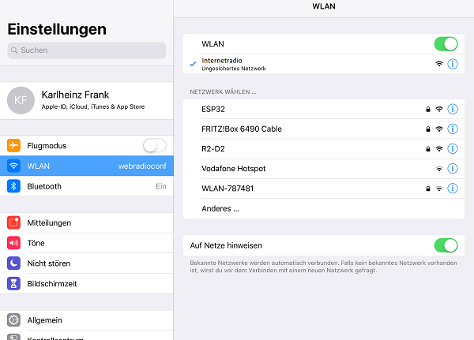

# Internetradio
Internetradio mit WEB-Server, TFT 1,88 oder LCD 4 Zeilen Display

## Story
Das Internetradio steht mit einem TFT 1,88" und einem LCD 4x20 mit I2C Schnittstelle zur Verfügung.
Neben dem gerade gespielten Sender werden Datum und Uhrzeit, sowie die aktuelle Lautstärke angezeigt. 
In den beiden unteren Zeilen werden Informationen zum laufenden Programm angezeigt, die mit dem Audiostream mitgeschickt werden. 
Die Lautstärkeregelung erfolgt ebenso, wie die Senderwahl über einen Rotary-Encoder. Die Konfiguration kann
über einen Browser erfolgen. Über diesen Weg ist die Senderliste veränder- und erweiterbar. 
Da manche URLs nicht abspielbar sind, kann eine URL über die Browserkonfiguration getestet werden, 
ehe sie gespeichert wird. Ein Firmwareupdate kann über WLAN (Over The Air = OTA) erfolgen.

## Hardware

| Anzahl | Bezeichnung | 
| -------- | -------- | 
| 1  | ESP32vn IoT UNO |
| 1  |  Shield  |
|  2 |  I2S Digitalverstärker mit MAX98357A  |
| 2  |  Lautsprecher  |
| 1  |  Widerstand 470 kOhm  |
| 1  |  Widerstand 10 kOhm  |
| 1  |  Elko 1000uF / 10V  |
| 2  | Drehgeber Encoder  |
| 2  | Drehknöpfe für 6mm Achse   |
|  1 | TFT 1,88"   |
|  1 | altern. LCD 4x20   |
| 1  | Gehäuse   |
|  1 |  5V-Netzteil  |
|   | Kabel   |
|  --- |  ---  |

## Verdrahtung

## Inbetriebnahme
Bei der ersten Inbetriebnahme sind noch keine Präferenzen vorhanden. Es kann daher keine Verbindung zum lokalen WLAN hergestellt werden. 
Ein Accesspunkt mit der SSID „webradioconf“ ohne Passwort wird gestartet. Mit z.B. einem Smartphone kann nun eine Verbindung zu diesem 
Accesspoint hergestellt werden. Danach kann in einem Browser über die Adresse 192.168.4.1 die Konfigurationsseite aufgerufen werden.

In den WLAN-Einstellungen „webradioconf“ auswählen

 

WLAN SSID und Password eingeben

 

 Nach der Eingabe "Neustart" auswählen
 
 

Kontrolle am Seriellen Monitor

 

Aufruf des WEB-Servers mit einem Browser

 

 

   
<ol class="breadcrumb" style="border-top: 2px solid black;border-bottom:2px solid black; height: 45px; width: 900px;"> 
<a href="#oben">nach oben</a>
</ol>

 
