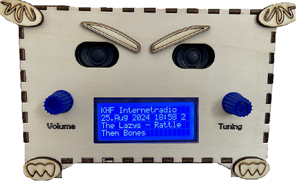
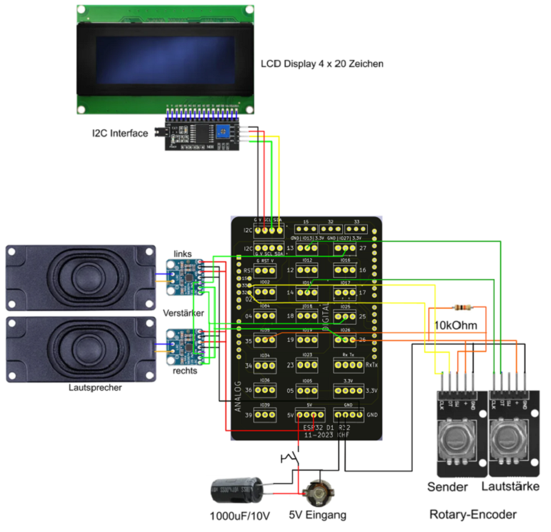
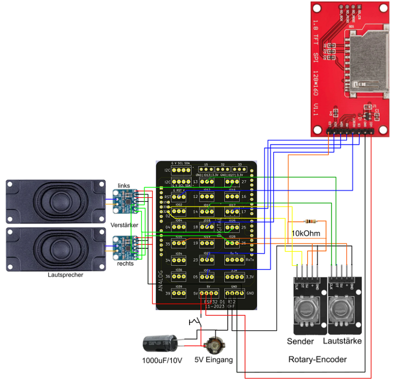

# Internetradio
Internetradio mit WEB-Server, OTA-Funktion, TFT 1,88 oder LCD 4 Zeilen Display, digitales Amplifier Board MAX98357A

## Story
Das Internetradio steht mit einem  TFT 1,88" Display oder einem LCD 4x20 Display mit I2C Schnittstelle zur Verfügung.
Neben dem gerade gespielten Sender werden Datum und Uhrzeit, sowie die aktuelle Lautstärke angezeigt. 
In den beiden unteren Zeilen sind die Informationen zum laufenden Programm, die mit dem Audiostream mitgeschickt werden. 
Die Lautstärkeregelung erfolgt ebenso wie die Senderwahl über einen Rotary-Encoder. Die Konfiguration kann
auch über einen Browser erfolgen. Über diesen Weg ist die Senderliste veränder- und erweiterbar. 
Da nicht jede Sender-URL abspielbar ist, kann die URL über die Browserkonfiguration vor dem speichern vorab getestet werden. 

Internetradio 

 

---

## Hardware

| Anzahl | Bezeichnung | 
| -------- | -------- | 
| 1  | ESP32vn IoT UNO |
| 1  |  Shield  |
|  2 |  I2S Digitalverstärker mit MAX98357A  |
| 2  |  Lautsprecher  |
| 1  |  Widerstand 470 kOhm  |
| 1  |  Widerstand 10 kOhm  |
| 1  |  Elko 1000uF / 10V  |
| 2  | Drehgeber Encoder  |
| 2  | Drehknöpfe für 6mm Achse   |
|  1 | TFT 1,88"   |
|  1 | altern. LCD 4x20   |
| 1  | Gehäuse   |
|  1 |  5V-Netzteil  |
|   | Kabel   |
|  --- |  ---  |

---

## Verdrahtung

Mit LCD-Display

Mit TFT-Display

---

### Inbetriebnahme

Bei der ersten Inbetriebnahme ist noch keine SSID und kein WLAN-Passwort vorhanden. Es kann daher keine Verbindung zum lokalen WLAN hergestellt werden. 
Ein Accesspoint mit der SSID „Internetradio“ wird gestartet. Mit einem Smartphone oder einem Tablet kann nun eine Verbindung zu diesem 
Accesspoint hergestellt werden. Danach kann in einem Browser über die Adresse 192.168.4.1 die Konfigurationsseite aufgerufen werden.

Nach dem Neustart sollte die Verbindung zum lokalen WLAN erfolgreich hergestellt werden können. 
Die Wiedergabe der ersten Station aus der Senderliste sollte mit einer Lautstärke von 50% starten. 
Mit dem Encoder für die Lautstärke kann die Verstärkung eingestellt werden. Änderungen werden in den Präferenzen gespeichert, 
sodass beim nächsten Einschalten dieselbe Lautstärke eingestellt wird. Mit dem anderen Encoder kann ein Sender aus der Senderliste gewählt werden. 
Beim Drehen des Encoders wird in der zweiten Zeile des Displays der Name der Station angezeigt. 
Durch Drücken des Kopfes am Encoder wird die gerade angezeigte Station gespeichert und die Wiedergabe gestartet. 
Auch dieser Wert wird in den Präferenzen gespeichert und beim nächsten Start die zuletzt gewählte Station wiedergegeben. 
Wird der Knopf am Encoder innerhalb von 10 Sekunden nicht gedrückt, springt die Anzeige auf die aktuelle Station zurück.

## WLAN-Daten speichern

Aufruf "Internetradio" in den WLAN-Einstellungen

Im Browser 192.168.4.1 eingeben

Im Browser die Zugangsdaten eingeben und neu starten

Kontrolle mit dem Seriellen Monitor

 

---

### Firmware Update über OTA

Über die URL http://Internetradio/ sollte die Konfigurationsseite abrufbar sein. Im oberen Teil können die Zugangsdaten und der NTP-Server geändert werden. 
Die Änderungen werden erst dann wirksam, wenn der Knopf „Speichern“ geklickt wurde.
Mit dem Knopf „Neustart“ kann ein Neustart ausgelöst werden.

Die Dropdown-Liste enthält alle Sender der Senderliste. Auswählbare Sender haben vor dem Namen einen schwarzen Punkt. 
Im Formular darunter sind die Daten zur ausgewählten Station gelistet und können geändert werden. 
Ist das Häkchen bei „Verwenden“ nicht gesetzt, ist die Station im Gerät nicht wählbar.
Da manche URLs nicht funktionieren, sollte man die neue URL testen (Testen-Button). 
Ein Klicken auf diesen Knopf startet die Wiedergabe der URL am Gerät. 
Sollte die Wiedergabe nicht funktionieren, wird sofort wieder auf den aktuellen Sender zurückgeschaltet und eine Meldung angezeigt. 
Ist die Wiedergabe möglich, wird eine Box mit einem Knopf angezeigt. Ein Klicken auf diesen Knopf schließt die Box und beendet den Test. 
Es wird wieder die aktuelle Station wiedergegeben.  Mit dem Knopf „Ändern“ können die Änderungen für die ausgewählte Station dauerhaft geändert werden.

---

 ## OTA Aufruf mit "Internetradio"

 

  

 ---
 

## Voreingestellte Senderliste

http://dispatcher.rndfnk.com/br/br1/nbopf/mp3/low
http://dispatcher.rndfnk.com/br/br3/live/mp3/low
http://stream.antenne.de/antenne
http://dispatcher.rndfnk.com/rbb/antennebrandenburg/live/mp3/mid
http://dispatcher.rndfnk.com/rbb/rbb888/live/mp3/mid
http://rnrw.cast.addradio.de/rnrw-0182/deinrock/low/stream.mp3
http://icecast.ndr.de/ndr/ndr2/niedersachsen/mp3/128/stream.mp3
http://icecast.ndr.de/ndr/ndr1niedersachsen/hannover/mp3/128/stream.mp3
http://wdr-1live-live.icecast.wdr.de/wdr/1live/live/mp3/128/stream.mp3
http://wdr-cosmo-live.icecast.wdr.de/wdr/cosmo/live/mp3/128/stream.mp3
http://st01.sslstream.dlf.de/dlf/01/128/mp3/stream.mp3
http://stream.1a-webradio.de/saw-deutsch/
http://streams.80s80s.de/ndw/mp3-192/streams.80s80s.de/
http://dispatcher.rndfnk.com/br/brklassik/live/mp3/low
http://mdr-284280-1.cast.mdr.de/mdr/284280/1/mp3/low/stream.mp3
http://wdr-wdr3-live.icecastssl.wdr.de/wdr/wdr3/live/mp3/128/stream.mp3
http://wdr-wdr2-aachenundregion.icecastssl.wdr.de/wdr/wdr2/aachenundregion/mp3/128/stream.mp3
http://rnrw.cast.addradio.de/rnrw-0182/deinschlager/low/stream.mp3
http://rnrw.cast.addradio.de/rnrw-0182/dein90er/low/stream.mp3

---
---

  <ol class="breadcrumb" style="border-top: 2px solid black;border-bottom:2px solid black; height: 45px; width: 900px;"> 
<a href="#oben">nach oben</a>
</ol>

 

---
